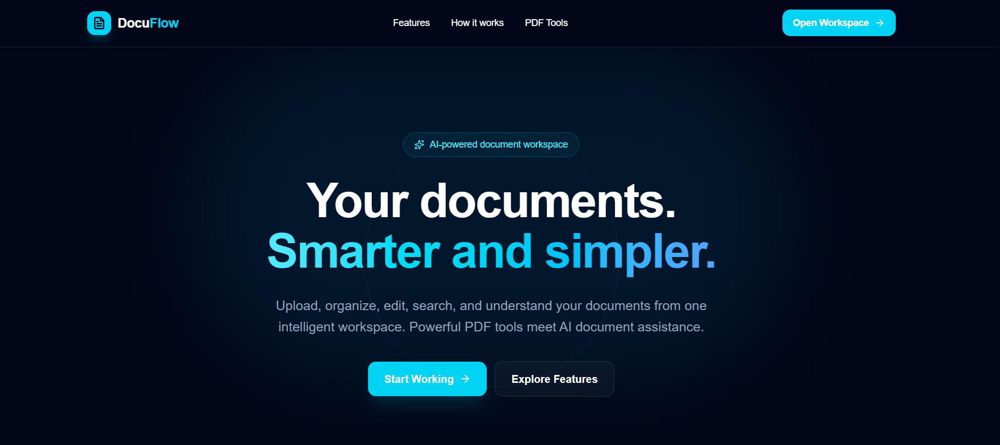
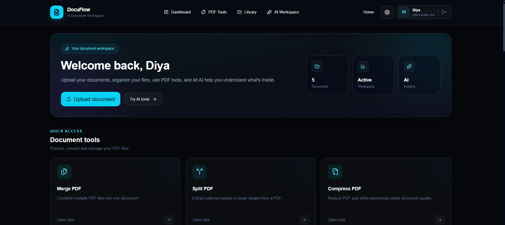
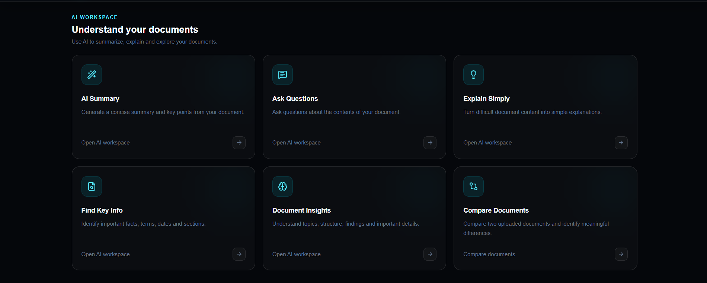
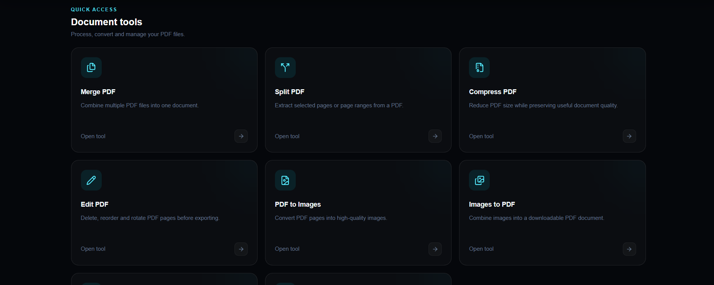

# DocuFlow

AI-powered document workspace for PDF processing, OCR, search, and intelligent document understanding.

[](https://nextjs.org/)
[](https://www.typescriptlang.org/)
[](https://docuflow-zeta-umber.vercel.app/)
[](https://ai.google.dev/)
[](https://github.com/AnchalGupta1117/docuflow)

## Live demo

Visit the app here: https://docuflow-zeta-umber.vercel.app/

## Screenshot gallery

### Home



### Dashboard



### AI assistant



### PDF tools



## Overview

DocuFlow is a modern document-first workspace designed to simplify how users work with PDFs, scanned files, extracted text, and AI-powered document understanding. Instead of jumping across several fragmented tools, users can upload documents, organize them, process them, and ask questions about their content from one streamlined interface.

The app blends PDF utilities, OCR workflows, search, and AI analysis into a single experience for students, professionals, researchers, and teams handling document-heavy tasks.

## Why DocuFlow?

Most document workflows still involve switching between separate tools for:

- PDF editing and merging
- OCR text extraction
- searching through large files
- asking questions about uploaded content
- keeping a readable document workspace organized

DocuFlow brings these capabilities together in one place so users can move from file upload to insight faster and with less friction.

## Core features

### Document workspace
- upload and manage documents in one dashboard
- browse recent files and workspace activity
- keep a lightweight local document environment for fast access

### PDF tools
- merge PDFs
- split PDFs by page or range
- compress large files
- rotate or reorder pages
- convert PDFs to images
- convert images into PDF documents

### OCR and search
- extract text from scanned or image-based documents
- search across uploaded content
- support quick lookup workflows for reports, notes, and research material

### AI document assistant
- ask questions about uploaded documents
- generate summaries of long content
- identify important facts and key takeaways
- explain content in simpler, clearer language

### Modern UX
- dark, premium dashboard interface
- clean tool navigation and organized layout
- fast access to key workflows from a single screen

## How it works

1. A user signs in or creates a local demo account.
2. A document is uploaded to the dashboard.
3. The file is stored locally in IndexedDB for browser persistence.
4. The user selects a PDF workflow or AI action.
5. The document is processed, searched, or analyzed through the app’s tool flow.

## Architecture

```text
User
  ↓
Next.js frontend
  ↓
DocuFlow app
  ├── PDF.js / pdf-lib
  ├── Tesseract.js for OCR
  ├── IndexedDB storage
  ├── localStorage session/auth
  └── Gemini API
        ↓
  Next.js API route
```

## Tech stack

- Next.js 16
- React 19
- TypeScript
- Tailwind CSS
- Framer Motion
- Lucide React
- Gemini API
- IndexedDB
- PDF.js
- pdf-lib
- Tesseract.js
- Mammoth

## Security and reliability

The current implementation includes several safeguards for a demo and prototype workflow:

- Gemini API key is kept server-side in the Next.js API route
- client-side validation runs before upload
- request validation is enforced in the AI route
- request size limits and rate limiting are configured
- file type checks and PDF signature validation help reduce invalid inputs

> Note: this is currently a local/demo-oriented authentication flow and is not a production-grade auth system.

## Project structure

```txt
docuflow/
├── app/
│   ├── api/
│   │   └── ai/
│   │       └── route.ts
│   ├── dashboard/
│   ├── documents/
│   ├── login/
│   ├── settings/
│   ├── signup/
│   ├── tools/
│   ├── globals.css
│   ├── layout.tsx
│   └── page.tsx
├── components/
│   ├── DocumentCard.tsx
│   ├── Navbar.tsx
│   ├── ToolCard.tsx
│   └── UploadZone.tsx
├── lib/
│   ├── auth.ts
│   ├── document-store.ts
│   └── utils.ts
├── public/
│   └── pdf.js/
├── screenshots/
│   ├── ai.png
│   ├── dashboard.png
│   ├── home.png
│   └── pdf_tools.png
├── eslint.config.mjs
├── next-env.d.ts
├── next.config.ts
├── package.json
├── postcss.config.mjs
├── tsconfig.json
├── README.md
└── .gitignore
```

## Getting started

### Install dependencies

```bash
npm install
```

### Set up environment variables

Create a `.env.local` file in the project root:

```env
GEMINI_API_KEY=your_google_gemini_api_key_here
GEMINI_MODEL=your_supported_gemini_model
```

### Run locally

```bash
npm run dev
```

Open the app in your browser at:

http://localhost:3000

## Available scripts

```bash
npm run dev
npm run build
npm run start
npm run lint
```

## Deployment

This project is deployed on Vercel:

https://docuflow-zeta-umber.vercel.app/

## Roadmap

Planned improvements include:

- refactor the dashboard into smaller reusable components
- standardize styling across all tool pages
- improve loading, empty, and error states
- strengthen accessibility and keyboard support
- move authentication to a secure backend-based system
- add persistent multi-user document storage
- expand automated testing and production-grade reliability

## License

This project does not currently include a license file. If you plan to distribute or publish it publicly, consider adding an appropriate open-source license.

## Author

Anchal Gupta